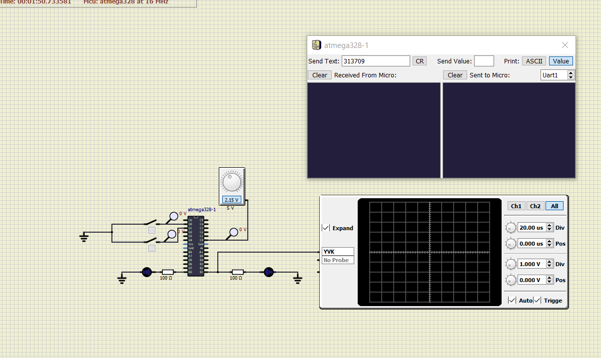
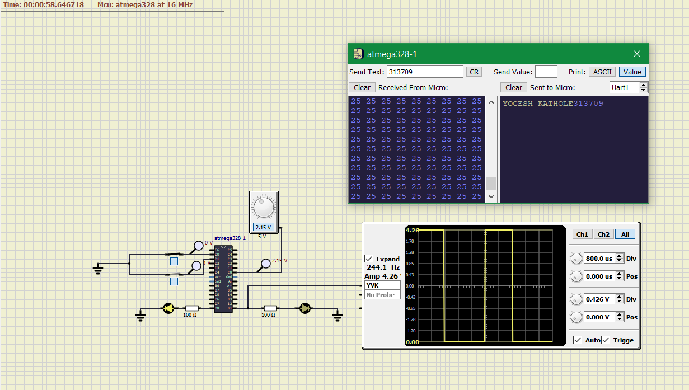

# Emb_C_LTTS
## CI and Code Qaulity
|Build|CppCheck|Codacy|
|:--:|:--:|:--:|
|||

Embedded Training LTTS
# Embedded C Case Study
Seat Heating System
-----------------
# Problem Statement: 

1. Button Sensor will check the passenger is sited or not
2. Temperature sensor works as :

ADC Value (Temp Sensor)| Output PWM
----------|----------
0-200 | 20% - 20 °C
210-500 | 40% - 25 °C
510-700 | 70% - 29 °C
710-1024 | 95% - 33 °C

3. Display CDD- CRO will give the temperature value by 
showing PWM.
4. Led Actuator shows the driver is sited 
5. Heater will check the heater button is ON.
6. Temp to CAN shows the value of temperature gone 
over protocol
## In Action

|OFF|
|:--:|
||
|On|
||
